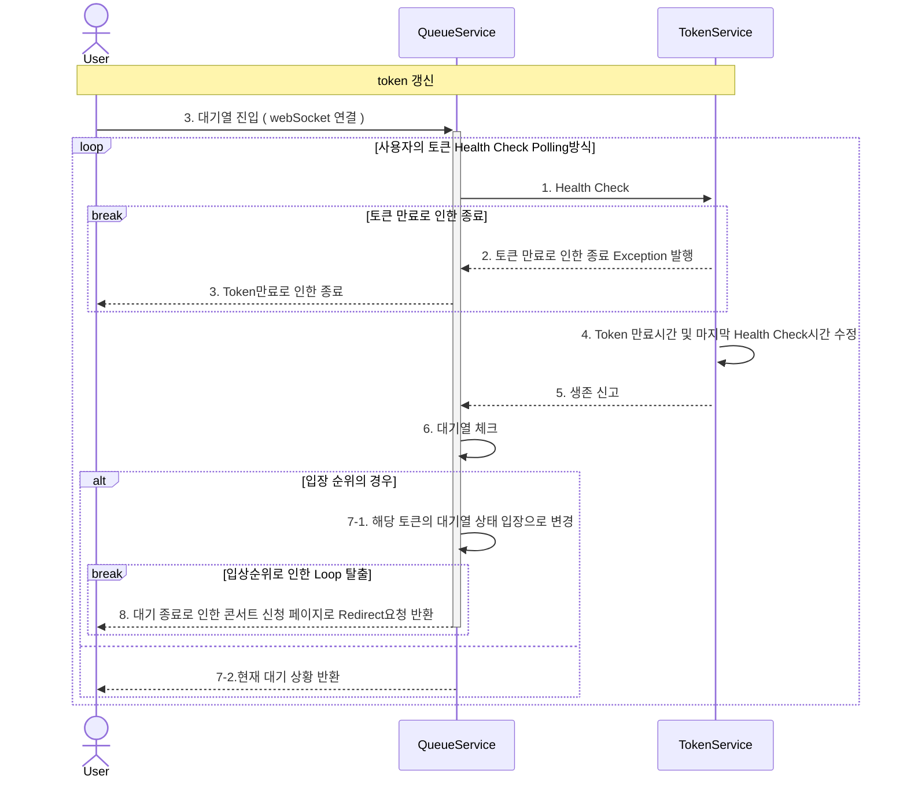
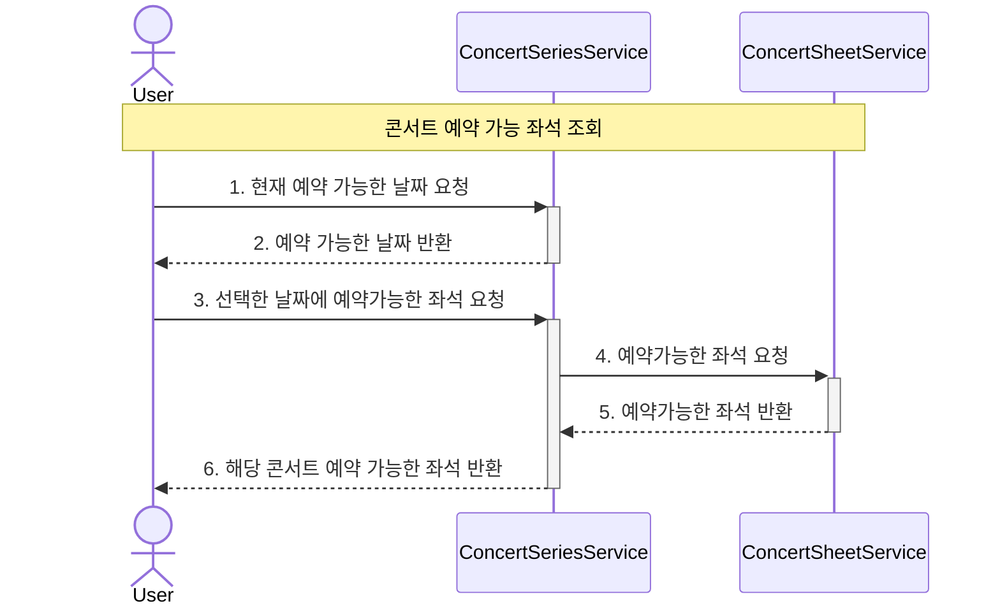
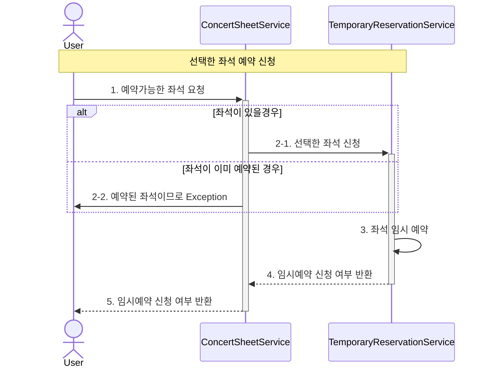
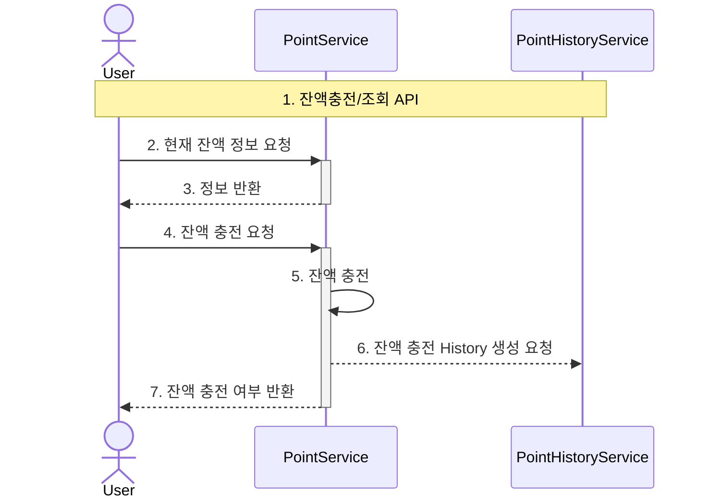
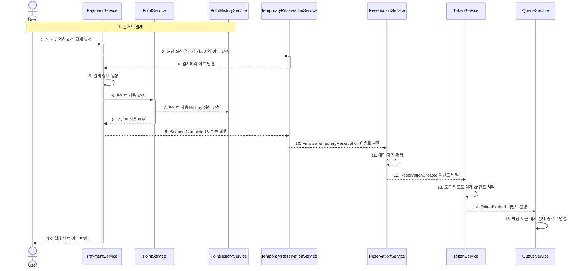

# 애니메이션 OST 콘서트 예약 서비스
애니메이션 OST 콘서트 예약 서비스입니다.  
전세계 오타쿠들이여 모여라~

## Sequence Diagram
### 1. 대기열 토큰 발급
````mermaid
sequenceDiagram
    actor User
    participant TokenService
    participant QueueService
    
    Note over User,TokenService: 토큰발급
    User->>+TokenService: 1. 대기열 입장을 위한 토큰 발급 요청
    TokenService->>+QueueService: 2. 현재 대기열 조회
    QueueService-->>-TokenService: 3. 현재 대기열 상황 반환
    TokenService->>TokenService: 4. 유저 정보를 통해 토큰 생성
    TokenService-->User: 5. 대기를 위한 토큰 발행
````
### 2. 토큰을 통한 사이트 입장 대기열 체크
Tip:   
특정시간동안 N명에게만 권한을 부여한다 - 신청가능 권한   
한번에 활성화된 최대 유저를 N으로 유지한다.

### 3. 예약 가능 날짜/좌석 조회 API
Tip: 좌석 정보는 1 ~ 50 까지의 좌석 번호를 관리합니다.

### 4. 좌석 예약 요청 API
Tip: 임시 배정 시간은 5분입니다.

### 5. 잔액 충전/조회 API

### 6. 결제 API

