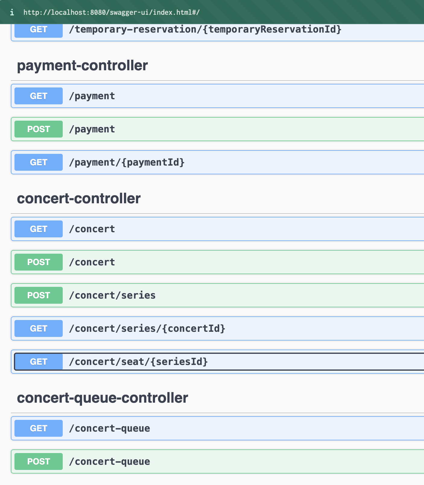

# 애니메이션 OST를 위한 콘서트 예약 서비스입니다.

    
사용자에게 제공되는 기능

1. 공연 목록 조회
2. 공연 날짜 및 좌석 조회
3. 공연 예약
4. 포인트 충전/사용/조회
5. 결제

    
오류 발생 케이스

1. 공연 날짜 및 좌석 조회
    1. 공연 날짜별로 생성이 안된 경우
2. 공연 예약
    1. 좌석이 이미 예약 된 경우
    2. 예약할 수 없는 Token을 가지고 있는 경우
       ex) 만료된 토큰 or 유효하지 않은 토큰
3. 포인트 충전/사용
    1. 동시에 여러번의 요청이 들어온 경우
    2. 사용금액이 보유 금액보다 많을 경우
    3. 0원을 충전/사용 하려 하는 경우
4. 결제
    1. 포인트가 결제 비용보다 적을 경우
    2. 예약한 좌석이 결제시간(5분)을 넘겨 해지된 경우

    
테스트시 주의 사항

1. 대기열
    1. 몇명이 들어올 것인가
    2. 몇명이 대기할 것인가
    3. 몇명을 입장 시킬 것인가
2. 콘서트 예약
    1. 여러명이 동일한 좌석을 요청할 경우
3. 결제
    1. 포인트 사용시 오류가 발생하였으면 임시예약한 공연은 어떻게 처리할 것인가.
    2. 결제 요청한 임시예약 공연은 유효한가?

## Sequence Diagram

    
1. 대기열 토큰 발급

    
2. 토큰을 통한 사이트 입장 대기열 체크

Tip:   
특정시간동안 N명에게만 권한을 부여한다 - 신청가능 권한   
한번에 활성화된 최대 유저를 N으로 유지한다.   

    
3. 예약 가능 날짜/좌석 조회 API

Tip: 좌석 정보는 1 ~ 50 까지의 좌석 번호를 관리합니다.

    
4. 좌석 예약 요청 API

Tip: 임시 배정 시간은 5분입니다.

    
5. 잔액 충전/조회 API

    
6. 결제 API

## ERD

    
ERD

TemporaryReservation: 임시예약 테이블   
Reservation: 예약 테이블

위 두테이블은 Concert와 ConcertSeries, ConcertSheet의 데이터들을 가질 수 있습니다.   
이를 위해 반정규화를 진행하려 하였으나 개발하면서 계속 수정이 이뤄질거 같아 참조 관계를 중점으로 ERD작성하였습니다.

## API 정의서

    
Swagger

### [Swagger 바로가기](http://localhost:8080/swagger-ui/index.html#/)

